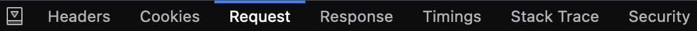

<div align="center">
    
    <h2>Update a Project's URL on LinkedIn (Tutorial)</h2>
</div>

> The Project URL field is not available for newly-added projects. To add a link to the Projects section, click/tap **Add media**, then select **Add a link**.
> [(Source)](https://www.linkedin.com/help/linkedin/answer/a1516731)

As you can see from the above quote, LinkedIn recently removed the ability to edit a project's URL. This repository contains a quick tutorial on how to get around this restriction using request forgery and get the `Show project` button back (shown below)!


> [!WARNING]  
> This guide was last updated on **Jan 28, 2025** and may get patched in the future. If it no longer works, please make an issue on this repository. After I review it, I'll archive this repository as needed.

> [!NOTE]  
> This guide will use Firefox terminology, but feel free to adapt the following steps to your preferred browser.

1. Head over to your LinkedIn project and click on the edit button.
   
   

2. Open up your browser's Web Developer Tools (`⌥ ⌘ I`) and head over to the `Network` tab.

   

3. Heading back over to LinkedIn while keeping the Web Developer Tools open, make any random change to the description of your project and click the `Save` button.
4. Back in the `Network` tab, click on the `POST` request to the URL that begins with the following:

   

5. Open up the `Request` tab and make sure `Raw` is checked.

   

6. Copy the entire `Request payload` and paste it in your preferred text editor. You should see JSON data similar to the following:
   
   ```json
   {
        "variables": {
            "formElementInputs": [
                {
                    "formElementUrn": "urn:li:fsd_profileEditFormElement:(PROJECT,urn:li:fsd_profileProject:(xxxxxxxxxxxxxxxxxxxxxxxxxxxxxxxxxxxxxxx,xxxxxxxxxx),/description)",
                    "formElementInputValues": [
                        {
                            "textInputValue": "Example description here."
                        }
                    ]
                }
            ],
            "trackingId": "xxxxxxxxxxxxxxxxxxxxxx"
        },
        "queryId": "voyagerIdentityDashProfileEditFormPages.xxxxxxxxxxxxxxxxxxxxxxxxxxxxxxxx",
        "includeWebMetadata": true
   }
   ```
7. Modify the JSON data:
   1. Change `/description` to `/url`.
   2. Update the value of `textInputValue` to the URL you want to add to your project.
   3. Remove the `trackingId` key-value pair along with the comma that follows it.
8. After modifying the JSON data, you should have something like this:

   ```json
   {
       "variables": {
           "formElementInputs": [
               {
                   "formElementUrn": "urn:li:fsd_profileEditFormElement:(PROJECT,urn:li:fsd_profileProject:(xxxxxxxxxxxxxxxxxxxxxxxxxxxxxxxxxxxxxxx,xxxxxxxxxx),/url)",
                   "formElementInputValues": [
                       {
                           "textInputValue": "https://github.com/Example-URL"
                       }
                   ]
               }
           ]
       },
       "queryId": "voyagerIdentityDashProfileEditFormPages.xxxxxxxxxxxxxxxxxxxxxxxxxxxxxxxx",
       "includeWebMetadata": true
   }
   ```

9.  Looking back in the `Network` tab, right click on the same `POST` request from earlier and click `Edit and Resend`.
10. In the `Body` field that appears, paste the modified JSON data and click `Send`.
11. Refresh the page.
12. ¡Voilà! Assuming you followed these steps correctly and LinkedIn hasn't patched this, the URL for your project should be updated now!

